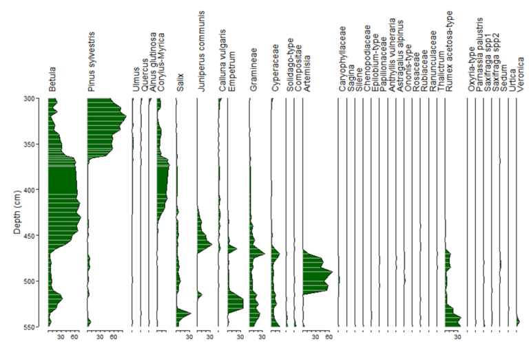
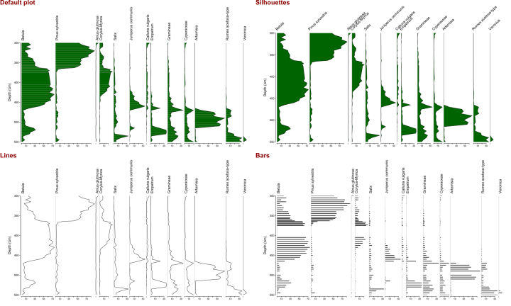
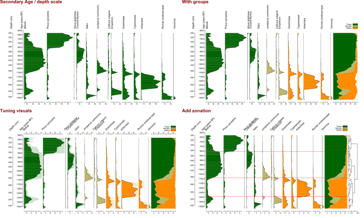
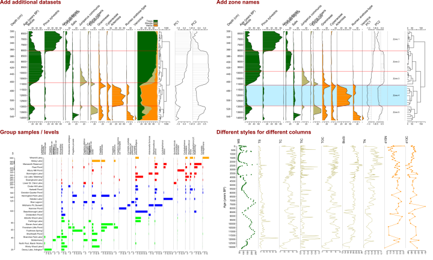
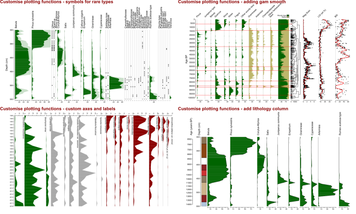

---
output:
  html_document
---

# riojaPlot: Stratigraphic diagrams in R


<br><br>

## Quick to get started

```> riojaPlot(poll, chron, scale.percent=TRUE)```



<br><br>

## Flexible: different plotting styles



## Flexible: add secondary axis, groups, zonation



## Flexible: combine different plotting elements



## Customise: functions for plotting data and axes


